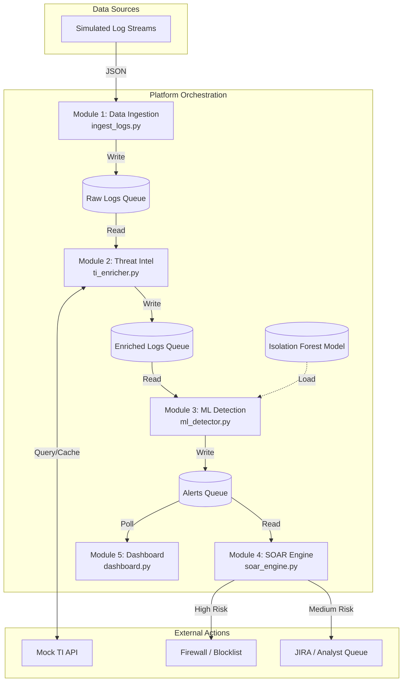

```mermaid
graph TD
    subgraph Data Sources
        Logs[Simulated Log Streams]
    end

    subgraph Platform Orchestration
        Ingest[Module 1: Data Ingestion<br/>ingest_logs.py]
        Q1[(Raw Logs Queue)]
        
        TI[Module 2: Threat Intel<br/>ti_enricher.py]
        Q2[(Enriched Logs Queue)]
        
        ML[Module 3: ML Detection<br/>ml_detector.py]
        Model[(Isolation Forest Model)]
        Q3[(Alerts Queue)]
        
        SOAR[Module 4: SOAR Engine<br/>soar_engine.py]
        Dash[Module 5: Dashboard<br/>dashboard.py]
    end

    subgraph External Actions
        API[Mock TI API]
        FW[Firewall / Blocklist]
        Ticketing[JIRA / Analyst Queue]
    end

    Logs -->|JSON| Ingest
    Ingest -->|Write| Q1
    Q1 -->|Read| TI
    TI <-->|Query/Cache| API
    TI -->|Write| Q2
    Q2 -->|Read| ML
    Model -.->|Load| ML
    ML -->|Write| Q3
    Q3 -->|Read| SOAR
    Q3 -->|Poll| Dash
    
    SOAR -->|High Risk| FW
    SOAR -->|Medium Risk| Ticketing
```
